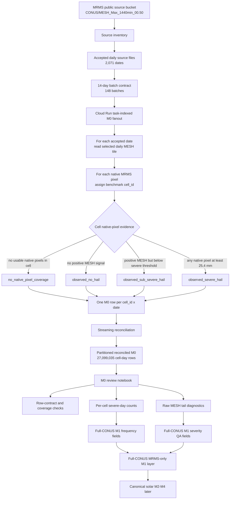

# 03 - MRMS M0 Review, Tail QA, and Full-CONUS M1 Policy

This note is the pause point between the completed **MRMS-only full-CONUS M0/M1** build and the next
**solar M2-M4 loss** work.

It answers:

```text
What did we run?
How did it become per-grid-cell numbers?
Which numbers are clean enough for M1?
Which numbers need QA before they can drive severity/loss?
```

---

## Current Answer

**Full-CONUS M0 is done and mechanically clean. The first full-CONUS MRMS-only M1 artifact has been built
and uploaded.**

The selected-cell M1 pilot remains only an interface proof for four cells. The new full-CONUS M1 artifact is
the first 13,085-cell MRMS-only V1 hazard layer. The artifact is suitable for screening and M2-M4 smoke
tests, but not yet for reportable loss metrics.

| Layer | Status | Meaning |
|---|---|---|
| Selected-cell M1 pilot | Done | Four-cell interface proof; not full CONUS and not final climatology. |
| Full-CONUS MRMS M0 | Done | One row per served cell per accepted MRMS source date. |
| Full-CONUS MRMS M0 review | Done | Row contract passed; maps and diagnostics written. |
| Full-CONUS MRMS M1 | Done and uploaded | One MRMS-only V1 row per served `cell_id`; frequency usable, severity provisional. |
| Solar M2-M4 from full M1 | Selected-cell smoke done | Full scaleout still waits for severity/frequency policy decisions below. |

The M1 policy from this review:

```text
Frequency:
  proceed from severe-hail cell-day flags.

Raw MESH severity:
  preserve for audit and diagnostics.

Extreme raw MESH:
  do not delete, but flag.
  use as event/context evidence only until a severity QA/capping/sensitivity rule is chosen.

M2-M4:
  do not feed raw extreme MESH magnitude directly into loss.
```

The current practical answer is:

```text
Ready now:
  M1 frequency screening and selected-cell M2-M4 smoke tests.
  The first selected-cell M2-M4 smoke run has completed.

Not ready yet:
  reportable EAL, VaR, PML, TVaR, or final calibrated hail-loss maps.
```

---

## Flow So Far

The easiest way to read the full workflow is:

```text
source-date denominator
  -> daily MRMS field
  -> native-pixel classification
  -> 0.25 degree cell-day evidence
  -> per-cell M1 frequency and provisional severity summaries
```

The severe-hail threshold is the same threshold used in the older single-site MRMS notebook:

```text
THRESHOLD_MM = 25.4
```

That is the one-inch NWS severe-hail threshold. Any `25 mm` wording in a plot title or quick explanation is
shorthand/rounding, not a different modeling rule.



The chart has two separate ideas that are easy to mix up:

1. **The severe threshold stayed the same**: `MESH >= 25.4 mm`.
2. **The spatial bucket changed**: a site-centered radius became a benchmark grid cell.

This is the same conceptual move as the single-site hail notebook, but the collection unit changed:

```text
single site:
  gather hail evidence around one asset / radius

CONUS grid:
  gather MRMS native pixels inside each 0.25 degree benchmark cell
```

So the grid does **not** use a 50-mile radius by default. The cell is the hazard bucket.

### Relation To The Older Single-Site MRMS Notebook

What changed from the old notebook is the spatial collection unit:

| Question | Single-site MRMS notebook | CONUS grid MRMS V1 |
|---|---|---|
| Severe threshold | `MESH >= 25.4 mm` | `MESH >= 25.4 mm` |
| Spatial bucket | 50-mile region around the site | One 0.25 degree benchmark `cell_id` |
| Event/count unit | Region-day severe hail evidence | Cell-day severe hail evidence |
| Frequency denominator | Days in the site study window | Accepted MRMS source days per served cell |
| Output purpose | Site-specific hail catalog / loss workflow | Comparable per-cell hazard layer |

So the grid is not a different hazard definition. It is the same severe-hail threshold applied inside each
benchmark grid cell instead of inside one site-centered radius.

The M0 cell-day status logic is:

| Cell-day state | Condition in the MRMS native pixels assigned to the cell | What it means for M1 |
|---|---|---|
| `no_native_pixel_coverage` | No usable native MRMS pixels assigned to that served cell on that date. | No-data, not zero hail. |
| `observed_no_hail` | Native pixels were observed, but no positive MESH signal. | Valid zero-severe day. |
| `observed_sub_severe_hail` | Positive MESH exists, but all observed values are below `25.4 mm`. | Valid non-severe hail/signal day; not a severe-day event. |
| `observed_severe_hail` | At least one native pixel has `MESH >= 25.4 mm`. | Counts as one severe hail cell-day for frequency. |

This is why M1 frequency is based on severe **cell-days**, not on the number of native pixels. Native-pixel
counts are still useful as footprint/context fields, but one cell with 1 severe native pixel and one cell with
100 severe native pixels both contribute one severe cell-day to the basic V1 count process.

---

## Runs and Counts

### Source Inventory

Source inventory run:

```text
run_id = 20260616T165806Z
source = CONUS/MESH_Max_1440min_00.50
requested window = 2014-01-01 to 2026-06-15
requested dates = 4,549
accepted source dates = 2,071
no-source dates = 2,478
first accepted source date = 2020-10-14
last accepted source date = 2026-06-15
missing accepted dates after first accepted = 0
listed source files = 99,313
planned M0 batches = 148
```

Interpretation: the requested window intentionally started before this MRMS product was publicly available in
the selected path. The accepted V1 denominator is the continuous window from `2020-10-14` to `2026-06-15`.

### Full M0 Fanout and Reconciliation

Cloud Run fanout:

```text
cloud_run_batch_run_id = 20260616T220624Z_m0_full_conus_task_indexed
execution = hazard-conus-grid-mrms-m0-54dm7
batches/tasks = 148
```

Reconciled M0:

```text
reconciled_run_id = 20260616T225000Z_m0_full_conus_reconciled
accepted dates = 2,071
served cells per date = 13,085
output rows = 27,099,035
duplicate cell-date rows = 0
failed date row counts = 0
combined panel written = false
```

The row count is the core contract:

```text
2,071 accepted source dates x 13,085 served cells = 27,099,035 cell-day rows
```

M0 review run:

```text
review_run_id = 20260616T232500Z_m0_review
status = review artifact created
upload_status = uploaded
uploaded outputs = 23
```

Review notebook:

```text
Notebooks/hazard_conus_grid/hail/m0_input_data/01_mrms_daily_mesh/
  05_mrms_v1_full_m0_review.ipynb
```

Review artifact root:

```text
data/hazard_conus_grid/hail/v1_mrms_only/m0_review/
  run_id=20260616T232500Z_m0_review/
```

---

## How One Cell-Day Row Becomes a Per-Grid Number

For each accepted MRMS daily source file:

```text
MRMS native pixels
  -> normalize lon/lat/grid conventions
  -> assign each native pixel to the benchmark 0.25 degree cell_id
  -> summarize all native pixels inside that cell
  -> write one row for every served cell_id
```

Each M0 row means:

```text
On this date, for this grid cell:
  did MRMS cover the cell?
  did it observe no hail, sub-severe hail, or severe hail?
  how many native MRMS pixels were observed?
  how many native pixels crossed the severe threshold?
  what was the raw max MESH in the cell?
  which source file/timestamp produced this row?
```

Core M0 fields:

| Field | Meaning | M1 use |
|---|---|---|
| `cell_id` | Benchmark grid join key. | M1 row identity. |
| `date` | Accepted MRMS source date. | Frequency denominator. |
| `coverage_status` | `observed_no_hail`, `observed_sub_severe_hail`, `observed_severe_hail`, or no coverage. | Separates zero from no-data. |
| `n_native_pixels_observed` | Native pixels assigned to the cell and read successfully. | Coverage QA. |
| `n_native_pixels_positive` | Native pixels with nonzero/sub-threshold hail signal. | Context only / possible future footprint. |
| `n_native_pixels_severe` | Native pixels with MESH `>= 25.4 mm`. | Severe-area proxy and severe-day flag. |
| `mesh_max_mm` | Daily max raw MESH inside the cell. | Conditional size evidence, but QA required. |
| `source_key` / `source_timestamp` | Exact MRMS source provenance. | Audit/rebuild lineage. |

M1 turns the daily rows into one row per cell:

```text
n_observed_days_cell
  = count of days with usable MRMS coverage for the cell

n_severe_hail_days_cell
  = count of days where the cell had n_native_pixels_severe > 0

observed_years_cell
  = n_observed_days_cell / 365.25

lambda_cell_raw
  = n_severe_hail_days_cell / observed_years_cell

empirical_size_summary_cell
  = distribution/summary of mesh_max_mm on severe-hail days, with QA flags
```

For this review run every served cell has full observed-day coverage:

```text
n_observed_days = 2,071 for all 13,085 cells
observed_day_fraction = 1.0 for all served cells
```

---

## What The M0 Review Found

Per-cell review summary:

| Item | Value |
|---|---:|
| Served cells | 13,085 |
| Accepted MRMS source dates | 2,071 |
| Cell-day rows | 27,099,035 |
| Cells with any severe hail day | 12,111 |
| Max severe hail days in one cell | 255 |
| Max raw annualized severe-day proxy | 44.972839 days/year |
| Max raw MESH | 1,437.400 mm |
| Cells with raw MESH `>= 300 mm` | 585 |
| Extreme raw-MESH cell-days | 613 |
| Dates with extreme raw MESH | 38 |

Distribution across cells:

| Field | Median | 90th pct | 95th pct | 99th pct | Max |
|---|---:|---:|---:|---:|---:|
| `n_severe_hail_days` | 9 | 28 | 33 | 42 | 255 |
| `lambda_cell_raw` | 1.587 | 4.938 | 5.820 | 7.407 | 44.973 |
| `max_mesh_mm` | 53.5 | 108.8 | 249.08 | 923.83 | 1,437.40 |
| `observed_day_fraction` | 1.0 | 1.0 | 1.0 | 1.0 | 1.0 |

Top extreme raw-MESH dates:

| Date | Extreme cell-days | Max raw MESH | States |
|---|---:|---:|---|
| 2024-07-16 | 305 | 1,376.9 | DE, MD, NJ, NY, OH, PA, VA, WV |
| 2022-01-03 | 111 | 1,057.7 | CO, NE, WY |
| 2022-03-11 | 42 | 1,174.2 | AR, KS, MO, OK |
| 2020-10-27 | 32 | 1,057.7 | KS, MO, OK |
| 2022-01-11 | 29 | 1,057.7 | CO, KS, NE, WY |

---

## What The Full M1 Artifact Shows

Full M1 run:

```text
m1_run_id = 20260618T040000Z_m1_mrms_only
local_root = data/hazard_conus_grid/hail/v1_mrms_only/m1_hazard_layer/run_id=20260618T040000Z_m1_mrms_only/
gcs_root = gs://infrasure-benchmark/hazard_conus_grid/dev/hail/v1_mrms_only/m1_hazard_layer/run_id=20260618T040000Z_m1_mrms_only/
upload_status = uploaded
```

M1 row contract:

| Item | Value |
|---|---:|
| M1 rows | 13,085 cells |
| M1 columns | 53 |
| Accepted source dates summarized | 2,071 |
| M0 cell-day rows summarized | 27,099,035 |
| Cells with any severe hail day | 12,111 |
| Cells with no severe hail days | 974 |

Severity status counts:

| `severity_magnitude_status` | Cells | Interpretation |
|---|---:|---|
| `raw_mesh_body_only` | 11,526 | Severe days exist and no raw MESH day crossed the 300 mm QA threshold. |
| `no_severe_days` | 974 | No severe hail day in the MRMS V1 denominator. |
| `raw_mesh_tail_requires_qa` | 585 | At least one raw MESH day crossed 300 mm; preserve event signal, do not trust raw magnitude blindly. |

M1 cross-cell distribution:

| Field | Median | 90th pct | 95th pct | 99th pct | Max |
|---|---:|---:|---:|---:|---:|
| `n_severe_hail_days` | 9 | 28 | 33 | 42 | 255 |
| `lambda_cell_raw` | 1.587 | 4.938 | 5.820 | 7.407 | 44.973 |
| `max_mesh_mm_raw_any_day` | 53.5 | 108.8 | 249.08 | 923.83 | 1,437.40 |
| `mesh_mean_mm_raw_on_severe_days` | 35.88 | 47.32 | 68.55 | 199.62 | 1,192.20 |
| `mesh_p95_mm_raw_on_severe_days` | 50.52 | 80.28 | 125.34 | 620.02 | 1,235.45 |

Top states by summed severe cell-days:

| State | Severe cell-days |
|---|---:|
| TX | 26,400 |
| KS | 10,608 |
| NE | 9,234 |
| OK | 7,745 |
| SD | 7,696 |
| CO | 6,970 |
| NM | 6,300 |
| MT | 5,376 |
| MO | 5,298 |
| IA | 4,874 |

The broad frequency geography is directionally credible: the central hail corridor is dominant, with Texas,
Kansas, Nebraska, Oklahoma, South Dakota, Colorado, and nearby Plains states leading the severe cell-day
counts.

The artifact also exposes two clear caution areas:

1. **Frequency spikes**: the max `lambda_cell_raw` is about 45 severe cell-days/year, driven by a New York
   cell with 255 severe days in the 2,071-day denominator. This may be a repeat radar/algorithm signal, but it
   is not accepted as final climatology without review.
2. **Raw-MESH severity tail**: 585 cells have at least one raw MESH value above 300 mm. These are not removed,
   because they can still identify storm/context dates, but the raw magnitude is not allowed to drive loss
   silently.

---

## What We Can Solve Now vs Later

### Solving Now

This V1 M1 layer can support:

- a reproducible full-CONUS MRMS-only severe-hail **screening** map;
- per-cell annual severe-hail-day frequency proxy: `lambda_cell_raw`;
- selected-cell M2-M4 smoke tests with explicit provisional-tail warnings;
- identifying cells and dates that need QA before final severity modeling;
- comparing grid cells on a consistent denominator and threshold.

### Not Solving Yet

This V1 M1 layer does **not** yet solve:

- final calibrated hail climatology;
- reportable EAL / VaR / PML / TVaR;
- hailstone-size truth from raw MRMS MESH;
- an EVT tail or calibrated damage-driving severity distribution;
- Storm Events / SPC date-level validation;
- Murillo & Homeyer style spatial de-biasing;
- NRI consistency checks after loss metrics.

These are future V1.5/V2 or validation-stage tasks, not blockers for a carefully labeled M2-M4 smoke run.

---

## How To Interpret The Extreme Raw MESH Tail

The key distinction:

```text
event signal:
  did the cell/day likely have severe convection or hail evidence?

severity magnitude:
  what hail-size value should enter empirical size distribution and loss?
```

Extreme raw MESH is **not automatically false evidence**. A `mesh_max_mm >= 300` row can still be useful as
evidence that the cell/date deserves severe-weather review.

But it is **not safe as literal hail-size severity**:

- MRMS MESH is radar-estimated, not observed hailstone size.
- The M0 field is a daily max over native pixels inside a 0.25 degree cell.
- Max-over-max logic naturally exaggerates the tail.
- Values above `1,000 mm` are physically implausible as hailstone size.
- Circular/ring-like spatial clusters look like source/algorithm artifacts, not normal storm footprints.

Therefore:

```text
M1 frequency:
  can use the severe-day flag after M0 row-contract review.

M1 size/severity:
  can preserve raw MESH and emit provisional observed summaries,
  but must carry a tail QA flag.

M2-M4 loss:
  must not silently treat raw extreme MESH as literal hail size.
```

---

## M1 Policy To Apply Next

The full-CONUS M1 build should write two classes of fields: **frequency fields** and **severity QA fields**.

### Frequency Fields

Proceed:

```text
freq_dist = poisson_v1_default
lambda_cell_raw = n_severe_hail_days / (n_observed_days / 365.25)
n_observed_days
n_severe_hail_days
observed_day_fraction
sparse_cell_flag
```

For V1, do not overfit Negative Binomial dispersion from a short operational-era record. If annual-count
diagnostics are computed, store them as diagnostics/flags, not as a more complex default model.

### Severity / Size Fields

Proceed, but mark as provisional:

```text
mesh_max_mm_raw
mesh_p50_mm_raw_on_severe_days
mesh_p90_mm_raw_on_severe_days
mesh_p95_mm_raw_on_severe_days
mesh_p99_mm_raw_on_severe_days
n_severe_days_with_size_sample
extreme_mesh_ge_300mm_flag
extreme_mesh_cell_day_count
max_mesh_mm_raw
severity_magnitude_status
```

Recommended status values:

| Status | Meaning |
|---|---|
| `no_severe_days` | No observed severe-hail days in the MRMS denominator. |
| `raw_mesh_body_only` | Severe days exist, no raw MESH `>= 300 mm`. |
| `raw_mesh_tail_requires_qa` | At least one raw MESH `>= 300 mm`; keep event signal, do not trust magnitude. |

The raw MESH values should remain in the artifact for audit/provenance. A later M1.5/M2-ready severity pass
can add:

```text
mesh_mm_qc_for_modeling
severity_tail_policy = capped | excluded | validated | sensitivity
```

### Allowed / Not Allowed Use

Allowed for the first full-CONUS M1:

- CONUS screening;
- frequency comparison across cells;
- identifying cells/dates needing severity review;
- feeding a provisional solar M2-M4 smoke run with tail warnings.

Not allowed:

- reportable EAL/PML/VaR/TVaR;
- final insured-loss climatology;
- treating raw `mesh_max_mm` above the QA threshold as literal hail size;
- calibrating solar loss severity from the raw extreme tail.

---

## M2-M4 Readiness Gate

We are **not** blocked from all M2-M4 work. We are blocked from pretending M2-M4 is final.

The right next M2-M4 step is a selected-cell smoke run only after these M1 handoff rules are accepted:

| Gate | Required state before M2-M4 smoke |
|---|---|
| Frequency source | Use `lambda_cell_raw` from M1, with `freq_dist = poisson_v1_default`. |
| Severity source | Use raw MESH summaries only as provisional observed evidence. |
| Tail policy | Carry `severity_magnitude_status`; do not allow `raw_mesh_tail_requires_qa` cells to drive final losses without sensitivity/capping. |
| Selected cells | Include central hail corridor, normal body cell, zero/no-severe cell, and suspicious high-frequency/tail-QA cell. |
| Output labeling | Every M2-M4 output must say `MRMS-only`, `V1`, `provisional severity`, and `not reportable`. |

Recommended first M2-M4 smoke set:

| Cell type | Purpose |
|---|---|
| Central hail corridor body cell | Test normal high-hail behavior. |
| Moderate body cell | Test typical non-tail behavior. |
| No-severe cell | Test zero-event handling and loss floor. |
| High-frequency suspicious cell | Test QA flags and prevent silent over-trust. |
| Tail-QA cell | Test raw-vs-capped/log severity sensitivity. |

Only after this smoke run looks coherent should we scale solar M2-M4 across all M1 cells.

### Selected-Cell M2-M4 Smoke Result

The first full-M1 selected-cell hail x solar M2-M4 smoke run has completed:

```text
risk_run_id = 20260618T045301Z_m2_m4_selected_cell_smoke
notebook = Notebooks/hazard_conus_grid/hail/solar/m2_m4_risk_metrics/03_full_m1_selected_cell_solar_smoke.ipynb
local_root = data/hazard_conus_grid/hail/solar/v1_mrms_only/m2_m4_selected_cell_smoke/run_id=20260618T045301Z_m2_m4_selected_cell_smoke/
gcs_root = gs://infrasure-benchmark/hazard_conus_grid/dev/hail/solar/v1_mrms_only/m2_m4_selected_cell_smoke/run_id=20260618T045301Z_m2_m4_selected_cell_smoke/
upload_status = uploaded
uploaded_objects = 9
```

Selected cells:

| Role | Cell | State | M1 status |
|---|---:|---|---|
| `central_corridor_body` | 302001 | KS | `raw_mesh_body_only` |
| `moderate_body` | 276114 | IA | `raw_mesh_body_only` |
| `no_severe` | 306280 | AZ | `no_severe_days` |
| `high_frequency_suspicious` | 273305 | NY | `raw_mesh_body_only`; frequency spike review |
| `tail_qa` | 281823 | WY | `raw_mesh_tail_requires_qa` |

The smoke run produced metric rows for two severity policies:

```text
raw_mrms
cap_100mm_sensitivity
```

All M4 engine QA checks passed. The output includes EAL, VaR95, VaR99, PML100, PML200, PML250, PML500, and
TVaR columns. The metrics are useful as a **provisional selected-cell smoke readout**, not as final or
reportable hail risk.

Important readout:

```text
The pipeline can now produce the comparable metric schema.
The open question is not mechanics; it is whether the severity/frequency policy is acceptable for scaleout.
```

---

## Full-CONUS M1 Notebook

Built:

```text
Notebooks/hazard_conus_grid/hail/m1_hazard_layer/02_full_conus_build/
  01_mrms_v1_full_grid_hazard_layer.py
  01_mrms_v1_full_grid_hazard_layer.ipynb
```

It should consume:

```text
data/hazard_conus_grid/hail/v1_mrms_only/
  m0_reconciled_daily_cell_evidence/run_id=20260616T225000Z_m0_full_conus_reconciled/
```

and write:

```text
data/hazard_conus_grid/hail/v1_mrms_only/
  m1_hazard_layer/run_id=20260618T040000Z_m1_mrms_only/
    tables/mrms_v1_m1_hazard_layer_20260618T040000Z_m1_mrms_only.parquet
    tables/mrms_v1_m1_summary_20260618T040000Z_m1_mrms_only.csv
    metadata_20260618T040000Z_m1_mrms_only.json
```

The notebook wrote review maps for:

- `lambda_cell_raw`;
- `n_severe_hail_days`;
- `severity_magnitude_status`;
- `max_mesh_mm_raw`, using compressed/log display;
- `extreme_mesh_cell_day_count`.

The M1 artifact has been uploaded to:

```text
gs://infrasure-benchmark/hazard_conus_grid/dev/hail/v1_mrms_only/m1_hazard_layer/run_id=20260618T040000Z_m1_mrms_only/
```

---

## Decision Record From This Pause

1. Full-CONUS M0 row contract is accepted for M1 input.
2. Full-CONUS M1 was built locally under `run_id=20260618T040000Z_m1_mrms_only`.
3. Full-CONUS M1 was uploaded to GCS under the matching `run_id`.
4. M1 frequency may proceed from severe cell-day flags.
5. Raw MESH tail is preserved, not discarded.
6. Raw MESH `>= 300 mm` is a severity QA flag, not an automatic event deletion rule.
7. Selected-cell solar M2-M4 smoke has completed under `risk_run_id=20260618T045301Z_m2_m4_selected_cell_smoke`.
8. Full-CONUS M2-M4 scaleout should wait for a decision on raw-vs-capped severity outputs and frequency-QA
   treatment for suspicious high-frequency cells.

---

## Cross-References

- M0 review notebook:
  `Notebooks/hazard_conus_grid/hail/m0_input_data/01_mrms_daily_mesh/05_mrms_v1_full_m0_review.ipynb`
- Full V1 build plan:
  [`../../../../plans/hazard_conus_grid/hail/v1_mrms_only_grid_build.md`](../../../../plans/hazard_conus_grid/hail/v1_mrms_only_grid_build.md)
- M0/M1 hazard layer plan:
  [`../../../../plans/hazard_conus_grid/hail/m0_m1_hazard_layer.md`](../../../../plans/hazard_conus_grid/hail/m0_m1_hazard_layer.md)
- Source triage:
  [`01_m1_sourcing_triage.md`](01_m1_sourcing_triage.md)
- Implementation flow:
  [`02_m1_build_flow.md`](02_m1_build_flow.md)
