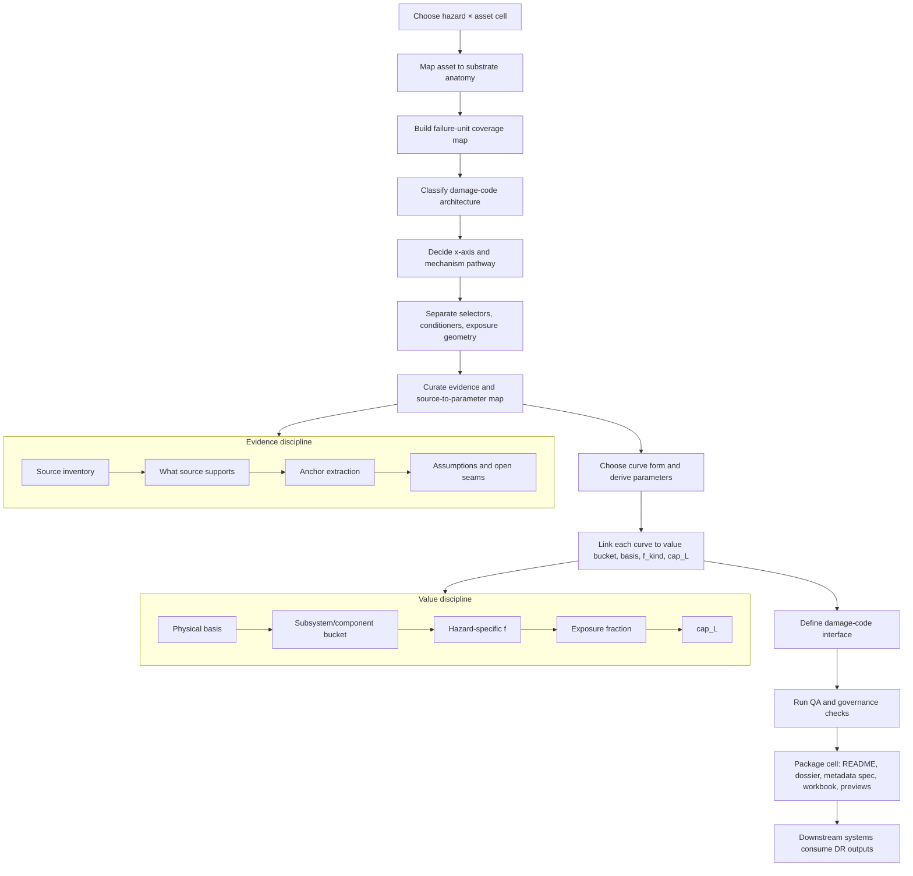

# 13 · End-to-end damage work architecture

**Status:** global method standard · v1.7  
**Purpose:** explain the full architecture of the damage-modeling work from the moment we pick a hazard × asset pair through the final damage-code package.  
**Audience:** builders, reviewers, downstream engineering/product users, and anyone asking, “How did this curve package come into existence?”

This document is the system-level map for the whole damage-curve library. It is not a curve derivation dossier for any one cell. It explains the reusable workflow that produced the current worked cells:

```text
01_cells/
├─ hail_solar/   current worked example: single-primary failure-unit cell
└─ flood_solar/  current worked example: multi-failure-unit geometry/exposure cell
```

The most important idea is simple:

> The damage work is not “draw a curve.” It is a governed **damage-code factory**. For each hazard × asset cell, we define what can fail, at what grain, against which hazard x-axis, with what curve form, from what evidence, modified by which selectors/conditioners/exposure variables, linked to which value bucket, and emitted in a format downstream systems can consume.

The framework is standardized so every future cell is auditable. The physics is **not** standardized into one shape. Hail and flood already prove that point: hail × solar is a single-primary module-damage curve, while flood × solar is a bundle of equipment-specific depth/inundation curves plus conditional velocity/scour pathways.

---

## 1. One-table summary — the eight-step architecture

| Step | Question answered | Main output | Example from `hail_solar` | Example from `flood_solar` |
|---:|---|---|---|---|
| **1** | What hazard × asset cell are we building? | Cell identity and scope | `HAIL_SOLAR` | `FLOOD_SOLAR` |
| **2** | What is the asset made of? | Substrate mapping: plant/generator → subsystem → component | `PV_ARRAY / PV_MODULE`, `MOUNTING / TRACKER` | `INVERTER_SYSTEM / INVERTER`, `SUBSTATION / SWITCHGEAR`, `SCADA` |
| **3** | What actually fails under this hazard? | Failure-unit coverage tree | Primary: PV module glass/cell replacement trigger | Primary: inverter, switchgear, transformer/control, combiner/DC, SCADA inundation |
| **4** | What kind of damage-code architecture is this? | Cell type and curve-record strategy | Single-primary failure-unit; reviewed DR≈0 buckets | Multi-failure-unit bundle; geometry/exposure-driven |
| **5** | What x-axis and metadata drive the damage? | X-axis decision; selectors, conditioners, exposure variables | MESH hail diameter; module archetype; stow state | Local depth above component datum; enclosure rating; energized state; equipment elevation |
| **6** | What curve form and derivation logic are justified? | Curve form decision, evidence map, fitted/interpolated parameters | Bounded logistic from hail-size breakage anchors | Piecewise/state depth-damage curves for electrical inundation |
| **7** | What value bucket does each damage ratio apply to? | Value-link records, basis, `f_kind`, cap logic | `PV_ARRAY / PV_MODULE` exposed material share | Component/equipment below-waterline geometry share |
| **8** | What does the package emit and how is it reviewed? | Damage-code interface, QA gates, open seams, package artifacts | `mesh_mm → module replacement DR` plus flags | `local_depth_m → failure-unit DR` bundle plus flags |

A shorter mnemonic:

```text
CELL → SUBSTRATE → COVERAGE → TYPE → AXIS/METADATA → CURVE PROOF → VALUE LINK → EMIT/QA
```

---

## 2. The whole system in one picture

```text
                               DAMAGE MODELING ARCHITECTURE
------------------------------------------------------------------------------------------------

  1. ENGINEERING SUBSTRATE
     "What is the asset made of?"
             │
             ▼
     plant / generator
       └─ subsystem
            └─ component

             │
             ▼

  2. HAZARD × ASSET CELL
     "Which hazard is acting on which asset class?"
             │
             ▼
     hail × solar
     flood × solar
     wind × wind
     wildfire × solar
     lightning × wind
     ...

             │
             ▼

  3. FAILURE-UNIT COVERAGE
     "What actually fails under this hazard?"
             │
             ▼
     primary nonzero units
     secondary / conditional units
     conditioner-only equipment
     exposure / protection modifiers
     DR≈0 reviewed buckets

             │
             ▼

  4. X-AXIS + MECHANISM DECISION
     "What hazard variable drives this damage?"
             │
             ▼
     MESH hail diameter
     local flood depth above component datum
     flow velocity / scour proxy
     gust speed
     fireline intensity
     lightning current / exposure proxy

             │
             ▼

  5. CURVE DESIGN + DERIVATION
     "What curve form is justified by the physics and evidence?"
             │
             ▼
     logistic
     piecewise/state curve
     empirical table
     fragility curve
     threshold curve
     placeholder with provenance

             │
             ▼

  6. SELECTORS / CONDITIONERS / EXPOSURE
     "How does this asset or event state modify the curve?"
             │
             ▼
     selectors: fixed asset attributes
     conditioners: event-time operating states
     exposure: how much of the value bucket is touched

             │
             ▼

  7. VALUE LINK
     "Which dollar bucket does this DR apply to?"
             │
             ▼
     subsystem/component value bucket
     physical basis
     at-risk f
     cap_L

             │
             ▼

  8. DAMAGE CODE OUTPUT
     "What does downstream code consume?"
             │
             ▼
     hazard input → failure-unit DR
     plus metadata flags, curve ID, assumptions, evidence, open seams

             │
             ▼

  9. DOWNSTREAM SYSTEMS
     "Hazard catalog, exposure engine, value ledger, and financial metrics."
             │
             ▼
     site hazard intensity / frequency
     asset metadata
     value ledger
     EAL / PML / TIV / scenario loss
```

---

## 3. Mermaid architecture diagram

Some Markdown viewers can render this directly. If not, the ASCII diagrams in this document carry the same meaning.



---

## 4. What the damage work is — and what it is not

The damage-curve library is the **vulnerability / damage-code layer**. It does not own the entire risk stack.

```text
THIS LIBRARY OWNS
├─ hazard × asset cell framing
├─ failure-unit coverage
├─ x-axis decisions
├─ curve forms and parameters
├─ evidence/provenance maps
├─ selectors, conditioners, exposure variables
├─ value-link targets and basis labels
├─ damage-code interface
└─ QA/open-seam governance

THIS LIBRARY DOES NOT OWN
├─ hazard catalog generation
├─ site-level frequency analysis
├─ portfolio accumulation
├─ insurance terms and limits
├─ EAL/PML/tail metric production
└─ final financial reporting
```

That separation matters because the same damage code can be used by several downstream systems:

```text
hazard event scenario      → apply DR at intensity x
hazard frequency curve     → integrate losses downstream
underwriting TIV schedule  → apply DR × value using policy basis
engineering what-if        → compare selectors/conditioners
portfolio analysis         → aggregate across sites outside this package
```

The cell package therefore emits **damage ratios and metadata**, not final business decisions.

---

## 5. The three layers that must stay separate

The architecture works because it keeps these layers separate:

```text
A. Asset anatomy
   What physical things exist?

B. Damage behavior
   What happens to those things under a hazard?

C. Financial application
   What dollars are attached to the damaged things?
```

More explicitly:

```text
ASSET ANATOMY LAYER
  substrate_decomposition
  plant → generator → subsystem → component

DAMAGE-CODE LAYER
  hazard × asset cell
  failure-unit curves
  selectors / conditioners / exposure
  curve derivation proof

VALUATION / FINANCIAL LAYER
  value bucket
  physical basis
  at-risk f
  TIV / physical-base / insured denominator
```

This is why a curve record should not quietly become an EAL model or a TIV model. The curve record says:

```text
x → damage ratio for this failure-unit
```

The value linkage says:

```text
that damage ratio applies to this value bucket, on this basis, with this f_kind
```

The downstream risk engine says:

```text
now combine hazard frequency, exposure, policy terms, and value to compute metrics
```

---

## 6. The core unit hierarchy

The library uses four related but different units:

| Unit | Meaning | Example | Why it matters |
|---|---|---|---|
| **Cell** | Hazard × asset pair; project-management unit | `hail × solar`, `flood × solar` | Defines the scope of one package. |
| **Failure-unit** | Thing that actually fails; curve-record unit | PV module glass/cell trigger; inverter inundation | Determines what DR means. |
| **Subsystem / component** | Engineering vocabulary and value-link unit | `PV_ARRAY / PV_MODULE`; `INVERTER_SYSTEM / INVERTER` | Prevents vague asset-level curves. |
| **Value bucket** | Dollar bucket the DR applies to | Exposed PV module value; inverter value | Prevents applying one component DR to full TIV. |

So the runtime shape is not:

```text
hazard × asset → one asset-level DR
```

It is:

```text
hazard × asset cell
   └─ one or more failure-unit damage records
        └─ each maps to one subsystem/component value bucket
```

This distinction is what allows the same framework to support both a simple-looking cell and a multi-curve cell.

### Example: hail × solar

```text
hail × solar
├─ cell
│
├─ failure-unit
│  └─ PV module glass/cell replacement trigger
│
├─ subsystem/component
│  └─ PV_ARRAY / PV_MODULE
│
└─ value bucket
   └─ exposed module value inside PV_ARRAY
```

### Example: flood × solar

```text
flood × solar
├─ cell
│
├─ multiple failure-units
│  ├─ inverter inundation
│  ├─ switchgear inundation
│  ├─ transformer/control inundation
│  ├─ combiner/DC protection inundation
│  ├─ SCADA cabinet inundation
│  └─ foundation/scour, conditional
│
├─ subsystem/component mappings
│  ├─ INVERTER_SYSTEM / INVERTER
│  ├─ SUBSTATION / SWITCHGEAR
│  ├─ SUBSTATION / TRANSFORMER_MAIN
│  ├─ INVERTER_SYSTEM / COMBINER_BOX
│  └─ FOUNDATION / FOUNDATION_BASE
│
└─ value buckets
   └─ one linked value bucket per failure-unit
```

---

## 7. The six foundation learnings we keep in the background

The current framework grew out of the six foundation discussions plus the assembled-record framing. These are not just history; they govern how new cells should be built.

| Foundation topic | Operating lesson | What it prevents |
|---|---|---|
| **00 assembled curve record** | Every curve record must carry identity, source, value link, x-axis, emit behavior, metric policy, and governed-by logic. | Ad hoc spreadsheets with no audit trail. |
| **01 granularity** | The atomic modeling row is the failure-unit. Use subsystem grain by default; go component-level only when the hazard mechanism concentrates. | Both over-detailed component sprawl and vague whole-asset curves. |
| **02 x-axis / intensity variable** | The x-axis is hazard-mechanism-specific. Prefer univariate v1 curves, but split/composite before forcing true 2-D. | False multivariate complexity and wrong x-axes. |
| **03 valuation** | `loss = DR × value` hides allocation, at-risk `f`, and basis. Basis must be explicit; `f` is hazard-specific. | Applying module DR to full TIV or mixing physical value with sunk/soft costs. |
| **04 curation / derivation** | Show the proof trail. References are inputs, not authorities. Standards anchor regions; they do not automatically create full curves. | “LLM-looking” curves with no source-to-parameter trail. |
| **05 emit object** | Emit schema should be honest about scalar, spread, states, and cap-binding. Distribution-ready structure can exist even if v1 is scalar/state. | Overconfident outputs and hidden cap bias. |
| **06 metrics / tail honesty** | EAL/tail metrics are downstream uses, not the core damage code. Tail should be withheld if no credible spread exists. | Spurious PML/tail metrics from scalar curves. |

The big meta-rule:

```text
Use the same documentation architecture.
Do not assume the same physics, curve form, or metadata pattern applies to every cell.
```

---

## 8. Step-by-step build flow

### Step 1 — Choose the hazard × asset cell

A cell is the work package.

```text
Input:
  hazard = hail / flood / wind / wildfire / lightning / ice / etc.
  asset  = solar / wind / BESS / thermal / hybrid / etc.

Output:
  cell_id
  scope
  reason for prioritization
```

Examples:

```text
HAIL_SOLAR
FLOOD_SOLAR
WIND_WIND
WILDFIRE_SOLAR
LIGHTNING_WIND
```

The cell is not automatically one curve. It is the container that may hold one or many failure-unit records.

---

### Step 2 — Pull the asset anatomy from substrate

The substrate gives the vocabulary for what exists.

For solar:

```text
solar generator
├─ PV_ARRAY
│  └─ PV_MODULE
├─ MOUNTING
│  └─ FIXED_MOUNT / TRACKER / RACKING_STRUCTURE
├─ INVERTER_SYSTEM
│  └─ INVERTER / COMBINER_BOX / DC_PROTECTION
└─ shared plant systems
   ├─ SUBSTATION
   ├─ ELECTRICAL_COLLECTION
   ├─ SCADA
   ├─ CIVIL_INFRA
   ├─ FOUNDATION
   ├─ FIRE_PROTECTION
   ├─ GROUNDING_LIGHTNING
   ├─ AUXILIARY_POWER
   └─ SITE_DRAINAGE
```

This step prevents a damage code from inventing its own asset vocabulary. Every failure-unit should map back to a known subsystem/component where possible.

---

### Step 3 — Create the failure-unit coverage map

This is where we ask:

```text
Under this hazard, what actually fails?
```

The output is the snapshot tree.

For hail × solar:

```text
hail × solar v1.3
├─ primary nonzero failure-unit
│  └─ PV_ARRAY / PV_MODULE / glass-cell replacement trigger
│
├─ conditioner-only equipment
│  └─ MOUNTING / TRACKER, because tracker stow changes module exposure
│
├─ reviewed secondary / low-materiality equipment
│  └─ SCADA / MET_STATION, exposed instruments
│
└─ DR≈0 direct-hail buckets in v1
   ├─ INVERTER_SYSTEM
   ├─ SUBSTATION
   ├─ CIVIL_INFRA
   ├─ FOUNDATION
   └─ SITE_DRAINAGE
```

For flood × solar:

```text
flood × solar v1.0
├─ primary nonzero failure-units
│  ├─ INVERTER_SYSTEM / INVERTER / cabinet-skid inundation
│  ├─ SUBSTATION / SWITCHGEAR / cabinet inundation
│  ├─ SUBSTATION / TRANSFORMER_MAIN / transformer-control inundation
│  ├─ INVERTER_SYSTEM / COMBINER_BOX + DC_PROTECTION / enclosure inundation
│  └─ SCADA / MONITORING_SYSTEM / control-cabinet inundation
│
├─ conditional / secondary failure-units
│  ├─ ELECTRICAL_COLLECTION / cable-conduit water path
│  ├─ FOUNDATION / scour or wet-soil support degradation
│  ├─ CIVIL_INFRA / roads-access-fencing
│  ├─ PV_ARRAY / PV_MODULE / total submersion or debris
│  └─ MOUNTING / RACKING_STRUCTURE / debris-velocity load
│
├─ exposure / protection modifiers
│  ├─ SITE_DRAINAGE
│  ├─ FLOOD_DEFENSE
│  ├─ equipment pad elevation
│  ├─ conduit sealing
│  └─ shutdown / energized state
│
└─ DR≈0 direct-flood buckets
   └─ equipment above waterline with no alternate ingress path
```

This step prevents two common errors:

```text
Bad outcome 1:
  one vague asset-level curve

Bad outcome 2:
  dozens of unnecessary subsystem curves
```

---

### Step 4 — Classify the damage-code architecture

Before deriving curves, classify the kind of cell we are building.

| Damage-code architecture type | Meaning | Example |
|---|---|---|
| **Single-primary failure-unit** | One dominant damage curve, other buckets reviewed | Hail × solar |
| **Multi-failure-unit bundle** | Several subsystem/component curves under one cell | Flood × solar |
| **Repeated-unit structural bundle** | Same curve applied across repeated units | Wind farm turbines |
| **Protection-mediated cell** | Damage depends heavily on protection systems | Lightning, flood defense |
| **Exposure-geometry cell** | Damage depends on what is physically exposed | Flood, surge, wildfire perimeter |
| **State-conditioned cell** | Damage depends on operating state | Tracker stow, turbine feathering, energized state |
| **Deferred-complexity cell** | Known second axis exists but v1 keeps a simpler structure | Wildfire residence time, flood duration |

Hail × solar is:

```text
single-primary failure-unit
state-conditioned
material-share f
```

Flood × solar is:

```text
multi-failure-unit bundle
geometry-exposure cell
state-conditioned for energized/shutdown state
```

This classification tells reviewers what to expect. It also tells builders which sections of the package are load-bearing.

---

### Step 5 — Decide the x-axis and mechanism pathway

The x-axis should be:

```text
the hazard variable that directly drives the failure mechanism,
preferably in the form the hazard catalog can actually supply.
```

For hail:

```text
operational x-axis:
  MESH-equivalent maximum hail diameter

physics bridge:
  diameter → impact kinetic energy proxy
```

For flood:

```text
electrical ingress x-axis:
  local water depth above component datum

structural/scour x-axis:
  velocity or depth–velocity proxy
```

The key rule:

```text
Do not force one universal axis just because the cell has one hazard.
Split by mechanism if needed.
```

ASCII version:

```text
hazard event
   │
   ├─ pathway A → x-axis A → failure-unit curve A
   ├─ pathway B → x-axis B → failure-unit curve B
   └─ pathway C → x-axis C → failure-unit curve C
```

Flood is the clearest example. The whole site may have one flood event, but different failure-units experience that event through different local variables:

```text
water surface elevation
   │
   ├─ local depth above inverter datum       → inverter DR
   ├─ local depth above switchgear datum     → switchgear DR
   ├─ local depth above SCADA cabinet datum  → SCADA DR
   └─ velocity / scour proxy                 → foundation/civil DR
```

---

### Step 6 — Separate selectors, conditioners, and exposure

This is one of the most useful architecture patterns.

```text
x-axis
  = hazard intensity

selector
  = fixed asset attribute that chooses the curve

conditioner
  = event-time state that shifts/blends the curve

exposure
  = how much of the asset/value bucket is actually touched
```

For hail × solar:

| Type | Example | Interpretation |
|---|---|---|
| X-axis | MESH-equivalent hail diameter | Hazard intensity input. |
| Selector | module archetype, glass thickness, tempered glass | Fixed module properties that choose/shift curve family. |
| Conditioner | tracker stow state, stow angle, stow success probability | Event-time operating state. |
| Exposure | array fraction hit by hail swath | How much of array value is in the swath. |
| Value concentration | module glass/cell share inside `PV_ARRAY` | Material-share `f`. |

For flood × solar:

| Type | Example | Interpretation |
|---|---|---|
| X-axis | water depth above component datum | Local inundation intensity. |
| Selector | enclosure rating, equipment type, mounting height, transformer type | Fixed equipment properties. |
| Conditioner | energized state, shutdown state, flood defense deployed | Event-time state. |
| Exposure | component below waterline, conduit water path, site inundation footprint | Geometry/pathway exposure. |
| Value concentration | equipment/value below waterline | Geometry/elevation `f`. |

This matters because `f` is not the same species everywhere:

```text
hail f
  = material share inside the PV array

flood f
  = site/elevation geometry share below waterline
```

---

### Step 7 — Decide whether this needs a new curve or an adjustment

This is the rule that prevents both underfitting and curve explosion.

```text
Create a NEW curve when:
  the failure mechanism changes,
  the material/equipment class is meaningfully different,
  the value bucket is different,
  and evidence supports a different response.

Use an ADJUSTMENT when:
  the mechanism is the same,
  but resistance, angle, exposure, or event-time state changes.
```

Examples:

| Situation | Treatment |
|---|---|
| 2.0 mm glass/glass module vs 3.2 mm glass/backsheet | Different module archetype curve or shifted curve family. |
| Tracker stowed vs unstowed | Conditioner adjustment / probability blend. |
| Partial hail swath | Exposure multiplier, not a new fragility curve. |
| Inverter inundation vs switchgear inundation | Separate failure-unit curves. |
| Same inverter, higher pad elevation | Exposure/local-depth adjustment, not a new curve. |
| NEMA enclosure difference | Selector adjustment or variant curve. |
| Flood depth vs flood velocity | Separate x-axis/pathway if different failure mechanism. |

Decision tree:

```text
candidate difference
   │
   ├─ different failure mechanism?
   │      └─ yes → consider new curve
   │
   ├─ same mechanism but fixed resistance changes?
   │      └─ yes → selector / curve variant / shift
   │
   ├─ same mechanism but event-time state changes?
   │      └─ yes → conditioner / shift / blend
   │
   ├─ same mechanism but less asset touched?
   │      └─ yes → exposure multiplier
   │
   └─ only value denominator changes?
          └─ value-link change, not curve change
```

---

### Step 8 — Choose the curve form

Curve form should be chosen from the mechanism and evidence, not copied from the last cell.

| Curve form | Good for | Example |
|---|---|---|
| **Bounded logistic** | Smooth transition from low to high probability of failure | Hail module breakage |
| **Piecewise/state curve** | Equipment transitions through discrete damage states | Flooded electrical equipment |
| **Empirical table** | Direct source gives depth-damage or fragility ordinates | Flood depth-damage tables |
| **Step threshold** | Clear pass/fail standard with little spread | Some protection-device limits |
| **Fragility distribution** | Structural probability of exceedance/failure | Wind/tower/blade structural damage |
| **Composite or split curves** | Apparent multivariate hazard | Flood depth + velocity; ice + wind |
| **Placeholder-with-provenance** | Needed cell exists but evidence is thin | Early v0 scaffold rows |

For hail × solar, bounded logistic made sense because breakage probability transitions smoothly with hail size.

```text
small hail          → low probability of module replacement
intermediate hail   → rapidly increasing breakage probability
very large hail     → approaches cap/max replacement trigger
```

For flood × solar, piecewise/state curves made more sense because equipment often moves through states:

```text
dry
→ water reaches ingress path
→ low-level wetting
→ critical components wet
→ submerged / likely replacement
```

The architecture should require every cell to explain:

```text
Why this form?
Why not the other common forms?
Which source supports the form?
Which parameters are source-anchored versus assumed?
```

---

### Step 9 — Curate evidence and build the derivation proof

This is the audit center of the package.

Every cell needs a derivation dossier, not just a curve.

```text
source inventory
   │
   ▼
source-to-parameter mapping
   │
   ▼
anchor extraction
   │
   ▼
curve form decision
   │
   ▼
parameter fitting / interpolation / judgment
   │
   ▼
variant rules
   │
   ▼
assumption register
   │
   ▼
open seams and update triggers
```

A source can support different levels of inference:

| Source support type | Meaning |
|---|---|
| **Direct parameter** | Source gives a usable ordinate, probability, threshold, or damage percentage. |
| **Anchor** | Source gives a point or boundary condition but not a whole curve. |
| **Direction** | Source supports whether vulnerability increases/decreases under a selector. |
| **Curve form rationale** | Source supports state-based vs smooth vs threshold behavior. |
| **Replacement rule** | Source supports replacement/reconditioning logic. |
| **Qualitative context** | Source helps interpret a mechanism but does not set numbers. |
| **Open seam** | Source confirms a variable matters but does not quantify it. |

The dossier must separate:

```text
what the source says
what we infer from it
which parameter it supports
how strong that support is
what remains assumed
```

This is the difference between a defensible damage code and a curve that merely looks plausible.

---

### Step 10 — Link the curve to value

Once the damage curve exists, connect it to the value ledger.

```text
failure-unit DR
   × value bucket
   × at-risk f
   × exposure fraction
   = failure-unit loss
```

General plug-in:

```text
loss = Σ_c DR_c(x_c) · (value_share_c · [·f if concentrated] · physical_base_$)
```

Examples:

```text
hail:
  DR_module(MESH)
  × PV_ARRAY value
  × module glass/cell f
  × hail swath exposure fraction

flood:
  DR_inverter(local_depth)
  × INVERTER_SYSTEM / INVERTER value
  × below-waterline geometry/exposure fraction
```

The important architecture rule:

```text
The curve outputs damage ratio.
The value link decides dollars.
The downstream engine decides EAL/PML/TIV metrics.
```

---

### Step 11 — Define the damage-code interface

The package should end in something code can consume.

Generic shape:

```yaml
damage_code_id: FLOOD_SOLAR_INVERTER_INUNDATION_V1
cell_id: FLOOD_SOLAR
failure_unit:
  subsystem: INVERTER_SYSTEM
  component: INVERTER
  failure_mode: electrical_ingress_inundation

hazard_axis:
  id: LOCAL_WATER_DEPTH_ABOVE_COMPONENT_DATUM
  unit: m

selectors:
  - enclosure_rating
  - inverter_mounting_type
  - critical_component_height_m

conditioners:
  - energized_state
  - shutdown_before_flood
  - flood_defense_deployed

exposure:
  - component_elevation_m
  - water_surface_elevation_m
  - conduit_ingress_path
  - site_inundation_fraction

curve:
  form: piecewise_state
  parameters_id: FS_INV_V1

outputs:
  - failure_unit_damage_ratio
  - damage_state
  - confidence_tier
  - open_seam_flags
```

For hail:

```yaml
damage_code_id: HAIL_SOLAR_PV_MODULE_GLASS_CELL_V1
cell_id: HAIL_SOLAR
failure_unit:
  subsystem: PV_ARRAY
  component: PV_MODULE
  failure_mode: glass_cell_replacement_trigger

hazard_axis:
  id: HAIL_DIAMETER_MESH_EQUIV
  unit: mm

selectors:
  - module_archetype
  - front_glass_thickness_mm
  - tempered_glass

conditioners:
  - mounting_type
  - stow_state
  - stow_angle_deg

exposure:
  - array_exposure_fraction

curve:
  form: bounded_logistic

outputs:
  - module_replacement_damage_ratio
  - selected_variant
  - source_confidence
  - open_seam_flags
```

---

### Step 12 — QA and governance gates

Every cell should pass the same checks, even if the curve forms differ.

```text
COVERAGE CHECK
  Did we review all relevant subsystems?
  Did we classify primary, secondary, conditioner-only, DR≈0?

X-AXIS CHECK
  Is the x-axis physically meaningful?
  Is it available from the hazard catalog or bridgeable?

CURVE-FORM CHECK
  Did we justify the chosen form?
  Did we explain rejected alternatives?

EVIDENCE CHECK
  Does every parameter have a source, assumption, or placeholder label?
  Are links/pointers included?

VALUE-LINK CHECK
  Does every curve map to exactly one value bucket?
  Are basis and f_kind explicit?

DOUBLE-COUNT CHECK
  Can two curves accidentally apply to the same value bucket?
  If yes, is there an assembly rule?

SELECTOR/CONDITIONER CHECK
  Are fixed asset attributes separated from event-time states?

EMIT CHECK
  Is the output scalar, state-based, spread-based, or distribution-ready?
  Are tail metrics withheld unless supported?

OPEN-SEAM CHECK
  Are weak assumptions clearly named?
  Are update triggers documented?
```

---

## 9. Build-time versus runtime architecture

A frequent confusion is whether all documentation fields must appear at runtime. They do not.

```text
BUILD-TIME PACKAGE
├─ README
├─ coverage tree
├─ x-axis decision
├─ derivation dossier
├─ evidence log
├─ alternatives rejected
├─ assumption register
├─ workbook audit sheets
└─ review checklist

RUNTIME DAMAGE CODE
├─ damage_code_id
├─ hazard axis input
├─ selector inputs
├─ conditioner inputs
├─ exposure inputs
├─ curve parameters
├─ output DR
└─ metadata flags
```

The build-time package proves and governs the damage code. The runtime object should be compact enough to be used by software.

---

## 10. How hail and flood taught us the architecture

The two current cells are complementary.

### Hail × solar taught us

```text
A cell can have one primary nonzero curve.
The main failure-unit can be component-level.
Operational x-axis may differ from physics bridge.
Module archetype is a selector.
Tracker stow is a conditioner.
Swath exposure is an exposure multiplier.
f_hail is a material-share value concentration.
Logistic can be appropriate for smooth breakage transition.
```

### Flood × solar taught us

```text
A cell can be a bundle of failure-unit curves.
The x-axis can be local to the component, not just site-level.
Depth and velocity may split into different pathways.
Elevation is exposure geometry.
Energized/shutdown state is a conditioner.
Drainage/flood defense is a protection/exposure modifier.
f_flood is geometry/elevation, not material-share.
Piecewise/state curves may be more appropriate than logistic.
```

Together:

```text
Same architecture.
Different physics.
Different curve forms.
Different metadata.
Different value-exposure logic.
```

This is exactly the intended design.

---

## 11. Anti-patterns the architecture is meant to prevent

| Anti-pattern | Why it is bad | Correct pattern |
|---|---|---|
| One whole-asset curve for every hazard × asset pair | Hides which equipment actually fails and misapplies DR to value. | Cell package contains one or more failure-unit curves. |
| Subsystem-first curve generation | Forces many empty or low-materiality curves before understanding the hazard mechanism. | Cell-first, failure-unit-record modeling. |
| Copying the last curve form | Hail logistic does not imply flood logistic or wind logistic. | Choose curve form from mechanism and evidence. |
| Treating standards as full curves | Standards often give pass/fail anchors, not complete vulnerability functions. | Use standards as anchors or constraints. |
| Mixing selectors and conditioners | Fixed module type is not the same as event-time stow state. | Separate selector, conditioner, exposure, and value concentration. |
| Applying component DR to full TIV | Inflates loss and hides basis issues. | Map every DR to a value bucket and basis. |
| Treating `f` as one universal concept | Hail `f` and flood `f` are different species. | Type `f_kind` per hazard mechanism. |
| Emitting tail metrics from scalar-only curves | Creates false precision. | Withhold or flag downstream tail metrics unless spread/distribution exists. |

---

## 12. What every future cell package should contain

At minimum:

```text
current/
├─ README_<cell>_<version>.md
├─ <cell>_curve_derivation_dossier_<version>.md
├─ <cell>_damage_code_metadata_spec_<version>.md
├─ workbook_sheet_manifest_<cell>_<version>.md
├─ CELL_DOCUMENTATION_CROSSWALK_<cell>_<version>.md
└─ damage_curve_records_<version>_<cell>.xlsx

previews/
├─ coverage preview
└─ dashboard or curve preview

archive/
└─ prior major versions
```

The package should answer these audit questions:

```text
1. What is the cell and why is it in scope?
2. Which subsystems/components were reviewed?
3. Which failure-units have primary nonzero curves?
4. Which units are secondary, conditioner-only, exposure modifiers, or DR≈0?
5. What is the x-axis for every primary failure-unit?
6. What alternatives were considered and rejected?
7. Why this curve form?
8. Which sources support which anchors/parameters/rules?
9. Which selectors choose variants?
10. Which conditioners adjust or blend curves?
11. Which exposure variables scale affected value?
12. Which value bucket does each DR apply to?
13. What assumptions remain open?
14. What does the runtime damage-code interface look like?
15. What QA checks passed or remain conditional?
```

---

## 13. Where this document fits in the package

This file is a global method document:

```text
00_global_method/13_end_to_end_damage_work_architecture.md
```

It should be read after the global index and before diving into any one cell:

```text
1. START_HERE.md
2. 00_global_method/00_index.md
3. 00_global_method/13_end_to_end_damage_work_architecture.md
4. 00_global_method/02_cell_package_standard.md
5. 00_global_method/05_curve_derivation_dossier_standard.md
6. 01_cells/<cell>/current/README_*.md
7. 01_cells/<cell>/current/*_curve_derivation_dossier_*.md
8. 01_cells/<cell>/current/damage_curve_records_*.xlsx
```

It complements, rather than replaces, the detailed standards:

```text
03_failure_unit_coverage_standard.md
04_x_axis_decision_standard.md
05_curve_derivation_dossier_standard.md
06_curve_form_and_adjustment_standard.md
07_selector_conditioner_exposure_standard.md
08_evidence_provenance_and_links_standard.md
09_damage_code_interface_standard.md
10_review_checklist.md
```

---

## 14. Final architecture statement

The damage work is a **cell-by-cell, failure-unit-based, evidence-backed damage-code library**.

```text
GLOBAL FRAMEWORK
  defines how all cells should be documented

CELL PACKAGE
  defines one hazard × asset pair

COVERAGE MAP
  defines what can fail and what is reviewed out

CURVE RECORDS
  define failure-unit damage behavior

DERIVATION DOSSIER
  proves where the curve came from

METADATA SPEC
  defines selectors, conditioners, and exposure inputs

VALUE LINK
  maps damage ratios to the correct physical value bucket

DAMAGE CODE INTERFACE
  gives downstream systems a clean runtime object
```

The most important discipline:

```text
Do not assume the last cell's pattern applies to the next cell.

Use the same documentation architecture,
but let the hazard mechanism choose:
  the failure-units,
  the x-axis,
  the curve form,
  the selectors,
  the conditioners,
  and the exposure logic.
```

That is the balance we want: standardized enough to be auditable, flexible enough to be physically honest.
