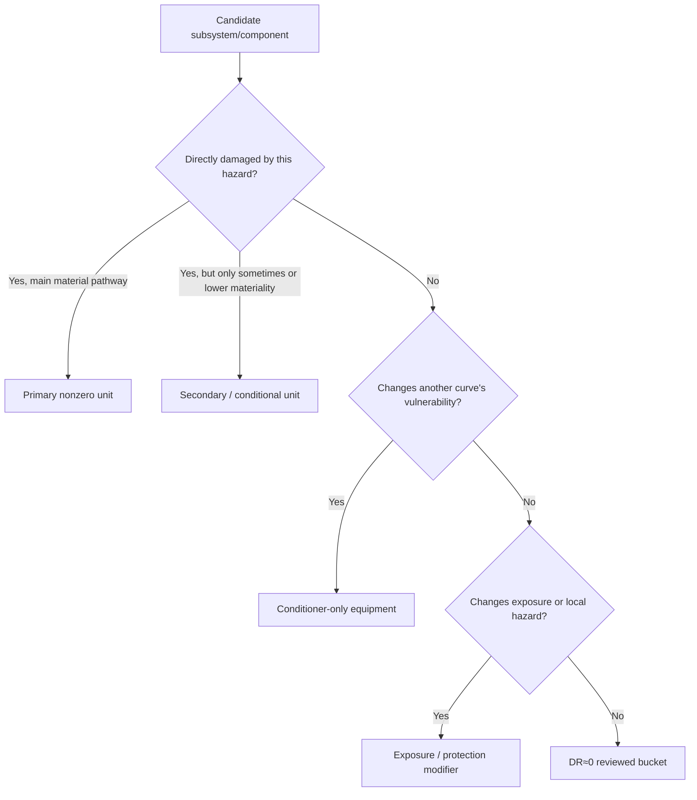

# 14 · Coverage Role Taxonomy — how to classify subsystems inside a hazard × asset cell

**Purpose:** This document defines the standard coverage-map roles used in each hazard × asset cell. It answers a deceptively important question:

> When we review a subsystem/component under a specific hazard, is it a directly damaged failure-unit, a conditional/secondary pathway, a state conditioner, an exposure/protection modifier, or an intentionally reviewed-out `DR≈0` bucket?

This taxonomy prevents two opposite mistakes:

```text
mistake A: one vague asset-level curve
   hail → solar plant damage %
   flood → solar plant damage %

mistake B: fake precision through too many weak curves
   hail → inverter curve
   hail → substation curve
   hail → foundation curve
   hail → drainage curve
```

The correct pattern is:

```text
review all relevant subsystems/components,
assign each one a coverage role,
model only the failure-units that the hazard mechanism actually supports,
and explicitly document reviewed-but-not-modeled buckets.
```

---

## 1 · The five coverage roles

| Role | Simple meaning | Does it get its own damage curve? | Typical output |
|---|---|---:|---|
| **Primary nonzero unit** | Main thing that directly gets damaged by this hazard. | Yes | Failure-unit DR curve. |
| **Secondary / conditional unit** | Can be damaged, but only under certain configurations, severe conditions, or lower-materiality pathways. | Maybe / optional / placeholder | Conditional DR, secondary curve, or open seam. |
| **Conditioner-only equipment** | Its state changes another curve, but it is not mainly the damaged value bucket. | Usually no direct curve | Curve shift, variant selection, or probability blend. |
| **Exposure / protection modifier** | Changes whether/how much hazard reaches equipment or how much value is exposed. | Usually no direct curve | Local intensity adjustment, exposure fraction, protection state. |
| **DR≈0 reviewed bucket** | Reviewed and intentionally assigned near-zero direct damage in v1 for this hazard mechanism. | No | Reconciliation row / reviewed-out note. |

These are **cell-specific roles**, not permanent labels. A subsystem can be `DR≈0` for one hazard and primary for another.

```text
INVERTER_SYSTEM
├─ hail × solar  → DR≈0 / secondary
└─ flood × solar → primary nonzero unit
```

---

## 2 · One-screen mental model

```text
hazard × asset cell
      │
      ▼
review all relevant subsystems/components
      │
      ├─ directly damaged and material?
      │      └─ primary nonzero unit
      │
      ├─ damaged only sometimes / lower materiality?
      │      └─ secondary / conditional unit
      │
      ├─ not mainly damaged, but changes vulnerability?
      │      └─ conditioner-only equipment
      │
      ├─ changes local hazard or exposed value?
      │      └─ exposure / protection modifier
      │
      └─ no direct material pathway in v1?
             └─ DR≈0 reviewed bucket
```

Mermaid version:



---

## 3 · Primary nonzero units

A **primary nonzero unit** is the main equipment that physically fails under the hazard mechanism. It receives a real damage curve.

```text
hazard intensity
      │
      ▼
damage curve
      │
      ▼
damage ratio > 0
      │
      ▼
applied to a value bucket
```

### Hail × solar example

```text
primary nonzero unit:
    PV_ARRAY / PV_MODULE / glass-cell replacement trigger

curve:
    MESH-equivalent hail diameter → module replacement DR
```

Why? Hail impact directly causes glass fracture, cell cracking, and module replacement.

```text
hailstone impact
   │
   ▼
glass fracture / cell cracking / module replacement
   │
   ▼
PV module damage ratio
```

### Flood × solar example

Flood has several primary nonzero units because water ingress directly damages multiple electrical equipment classes:

```text
flood × solar primary nonzero units
├─ INVERTER_SYSTEM / INVERTER
├─ SUBSTATION / SWITCHGEAR
├─ SUBSTATION / TRANSFORMER_MAIN
├─ INVERTER_SYSTEM / COMBINER_BOX + DC_PROTECTION
└─ SCADA / MONITORING_SYSTEM
```

The x-axis is not generic site depth. It is local water depth above each component datum:

```text
local water depth above component datum
      │
      ▼
electrical ingress / wetting / submersion
      │
      ▼
equipment damage ratio
```

---

## 4 · Secondary / conditional units

A **secondary / conditional unit** can be damaged, but it is not the default first-order pathway for the cell. It may receive a secondary curve, a conditional rule, a placeholder, or an open seam.

```text
secondary / conditional does not mean irrelevant.
It means: model only when the condition that makes it relevant is present.
```

### Hail × solar example

```text
secondary / conditional:
    SCADA / MET_STATION
```

Exposed sensors or instruments can be damaged by hail, but they usually do not dominate loss compared with PV module breakage.

```text
hail
├─ big direct loss: PV modules
└─ smaller possible loss: exposed sensors / met station
```

### Flood × solar example

```text
secondary / conditional:
├─ PV_ARRAY / PV_MODULE / total submersion or debris impact
├─ MOUNTING / RACKING_STRUCTURE / debris-velocity load
├─ ELECTRICAL_COLLECTION / cable-conduit water path
└─ CIVIL_INFRA / roads-access-fencing
```

PV modules are not automatically damaged because the site floods. They become relevant when water reaches the module elevation, debris impact is modeled, or prolonged submersion is in scope.

```text
flood depth below module lower edge
   → PV module DR≈0 / reviewed secondary

flood reaches modules or debris impact occurs
   → PV module becomes secondary nonzero pathway
```

---

## 5 · Conditioner-only equipment

A **conditioner-only equipment** item does not primarily receive the damage curve. Instead, its state changes another component's vulnerability.

This is one of the most important distinctions in the framework.

### Hail × solar example: tracker

```text
conditioner-only equipment:
    MOUNTING / TRACKER
```

The tracker is not the primary hail-damaged value bucket in v1. Its stow position changes the hail exposure and effective impact on the modules.

```text
tracker unstowed
   → modules more exposed

tracker stowed
   → modules at safer angle
   → lower effective hail impact
```

So the relationship is:

```text
MESH hail diameter
      │
      ▼
PV module base curve
      │
      ├─ if unstowed: higher DR
      └─ if stowed: lower DR
```

It is **not** primarily:

```text
hail → tracker damage curve
```

It is:

```text
tracker state → modifies hail → module damage curve
```

### Wind × wind example

For wind/tornado × wind, `PITCH_SYSTEM`, `BRAKE_SYSTEM`, and yaw alignment may initially act as conditioners because turbine feathering, braking, and yaw state change blade/tower vulnerability.

```text
gust speed
   │
   ▼
blade/tower damage curve
   │
   ├─ feathered correctly: lower damage
   └─ not feathered / brake failure: higher damage
```

The same equipment may also become a directly damaged failure-unit if evidence supports it. The coverage role is not permanent; it depends on the hazard mechanism and modeling scope.

---

## 6 · Exposure / protection modifiers

An **exposure/protection modifier** changes whether the hazard reaches equipment, how much value is exposed, or what local hazard intensity the component experiences.

It usually modifies the input or exposed value, rather than receiving its own damage curve.

### Flood × solar examples

```text
exposure / protection modifiers
├─ SITE_DRAINAGE / DRAINAGE_SYSTEM
├─ SITE_DRAINAGE / FLOOD_DEFENSE
├─ equipment pad elevation
├─ inverter skid elevation
├─ substation yard elevation
├─ conduit sealing
└─ berm / floodwall / pump availability
```

These variables modify local depth or exposure:

```text
regional flood depth
      │
      ▼
site drainage / berm / pad elevation
      │
      ▼
local water depth at inverter
      │
      ▼
inverter damage curve
```

### Hail × solar example

```text
exposure modifier:
    array exposure fraction
```

A hail swath may hit only part of the plant.

```text
hail swath hits 40% of array
      │
      ▼
only 40% of PV_ARRAY value is exposed
```

This is not a new fragility curve. It is an exposure multiplier:

```text
loss = DR_module × PV_ARRAY value × f_hail × exposure_fraction
```

### Conditioner vs exposure/protection modifier

| Role | Changes what? | Example |
|---|---|---|
| **Conditioner** | The vulnerability curve or damage response. | Tracker stow lowers module vulnerability. |
| **Exposure modifier** | The amount of value exposed. | Only 40% of array is hit by hail swath. |
| **Protection modifier** | The local hazard reaching the component. | Berm/freeboard lowers depth at inverter. |

Short version:

```text
conditioner changes vulnerability.
exposure modifier changes affected amount.
protection modifier changes local hazard reaching equipment.
```

---

## 7 · DR≈0 reviewed buckets

A **DR≈0 reviewed bucket** is a subsystem/component that was explicitly reviewed and intentionally assigned near-zero direct damage in v1.

This does **not** mean the equipment has no value. It means:

```text
For this hazard mechanism, direct physical damage to this bucket is not material enough,
not sourceable enough, or not physically plausible enough to model as a nonzero v1 curve.
```

### Hail × solar example

```text
DR≈0 direct-hail buckets in v1
├─ INVERTER_SYSTEM
├─ SUBSTATION
├─ CIVIL_INFRA
├─ FOUNDATION
└─ SITE_DRAINAGE
```

Why? Direct hail impact is not usually the main damage mechanism for these buckets.

```text
hail
├─ damages modules directly
├─ may damage small exposed sensors
└─ usually does not meaningfully damage:
   ├─ foundation
   ├─ drainage
   ├─ buried cables
   ├─ major substation internals
   └─ civil infrastructure
```

The purpose of documenting DR≈0 buckets is auditability:

```text
Question: Did you forget about the inverter/substation/foundation?
Answer: No. Reviewed. Marked DR≈0 for direct hail in v1.
        Revisit if evidence, asset configuration, or modeling scope changes.
```

---

## 8 · Why these roles matter

### 8.1 Avoid one vague asset-level curve

Bad:

```text
hail → solar plant damage %
flood → solar plant damage %
```

Better:

```text
hail → PV module damage %
     → applied only to exposed PV module/PV_ARRAY value

flood → inverter depth-damage
      → switchgear depth-damage
      → transformer/control depth-damage
      → SCADA depth-damage
```

### 8.2 Avoid fake precision through unnecessary curves

Bad:

```text
hail → inverter curve
hail → substation curve
hail → foundation curve
hail → drainage curve
hail → road curve
```

Better:

```text
hail
├─ PV module curve
├─ tracker as conditioner
├─ SCADA/met station as secondary
└─ other buckets reviewed as DR≈0
```

### 8.3 Avoid double-counting

If tracker stow modifies module vulnerability, do not also count tracker as a separate loss unless there is a real tracker damage pathway.

```text
tracker as conditioner
   ≠ tracker as damaged value bucket
```

If drainage/flood defense reduces local depth at equipment, do not also treat the full protected equipment value as damaged unless local depth still reaches it.

```text
flood defense as protection modifier
   ≠ flood defense failure automatically equals inverter loss
```

### 8.4 Make downstream damage code clean

The damage-code layer should say:

```text
primary curve outputs DR.
conditioners modify DR.
exposure/protection variables modify local intensity or exposed value.
DR≈0 buckets preserve review and reconciliation.
```

---

## 9 · Same subsystem, different roles across hazards

| Subsystem / component | Hail × solar | Flood × solar | Wind × solar |
|---|---|---|---|
| `PV_ARRAY / PV_MODULE` | Primary nonzero | Secondary/conditional | Possible primary/secondary |
| `INVERTER_SYSTEM` | DR≈0 / secondary | Primary nonzero | Usually secondary |
| `MOUNTING / TRACKER` | Conditioner-only | Secondary/conditional | Primary or conditioner |
| `SUBSTATION` | DR≈0 | Primary nonzero | Secondary/conditional |
| `SITE_DRAINAGE` | DR≈0 | Protection/exposure modifier | Usually not central |
| `FOUNDATION` | DR≈0 | Conditional scour | Primary/conditional for wind uplift |

Never write:

```text
INVERTER_SYSTEM = secondary
```

Write:

```text
INVERTER_SYSTEM is secondary/DR≈0 for hail × solar,
but primary for flood × solar.
```

The coverage role is always **cell-specific**.

---

## 10 · Hail × solar classified

```text
hail × solar
├─ primary nonzero units
│  └─ PV_ARRAY / PV_MODULE
│     └─ glass-cell replacement trigger
│
├─ secondary / conditional units
│  └─ SCADA / MET_STATION
│     └─ exposed instruments can be damaged, usually low materiality
│
├─ conditioner-only equipment
│  └─ MOUNTING / TRACKER
│     └─ stow angle changes module hail vulnerability
│
├─ exposure / protection modifiers
│  ├─ array exposure fraction
│  ├─ hail swath footprint
│  └─ stow control availability / warning lead time, when modeled as exposure-to-stow reliability
│
└─ DR≈0 reviewed buckets
   ├─ INVERTER_SYSTEM
   ├─ SUBSTATION
   ├─ CIVIL_INFRA
   ├─ FOUNDATION
   └─ SITE_DRAINAGE
```

Loss logic:

```text
MESH diameter
   │
   ▼
PV module damage curve
   │
   ├─ selected by module archetype
   ├─ conditioned by tracker stow
   └─ scaled by array exposure fraction
   │
   ▼
damage ratio applied to PV_ARRAY / PV_MODULE value bucket
```

---

## 11 · Flood × solar classified

```text
flood × solar
├─ primary nonzero units
│  ├─ INVERTER_SYSTEM / INVERTER
│  ├─ SUBSTATION / SWITCHGEAR
│  ├─ SUBSTATION / TRANSFORMER_MAIN
│  ├─ INVERTER_SYSTEM / COMBINER_BOX + DC_PROTECTION
│  └─ SCADA / MONITORING_SYSTEM
│
├─ secondary / conditional units
│  ├─ ELECTRICAL_COLLECTION / CABLE_AC + CABLE_DC
│  ├─ FOUNDATION / FOUNDATION_BASE
│  ├─ CIVIL_INFRA / roads-access-fencing
│  ├─ PV_ARRAY / PV_MODULE
│  └─ MOUNTING / RACKING_STRUCTURE
│
├─ conditioner-only equipment / states
│  ├─ energized_state
│  ├─ shutdown_before_flood
│  └─ flood_defense_deployed
│
├─ exposure / protection modifiers
│  ├─ SITE_DRAINAGE / DRAINAGE_SYSTEM
│  ├─ SITE_DRAINAGE / FLOOD_DEFENSE
│  ├─ equipment elevation
│  ├─ pad height
│  ├─ conduit water path
│  └─ inundation footprint
│
└─ DR≈0 reviewed buckets
   └─ equipment above waterline with no alternate ingress path
```

Loss logic:

```text
flood water surface elevation
      │
      ▼
local depth above each component datum
      │
      ├─ inverter curve
      ├─ switchgear curve
      ├─ transformer/control curve
      ├─ combiner/DC curve
      └─ SCADA curve
```

---

## 12 · Coverage-role decision tree for new cells

Use this whenever starting a new cell.

```text
component / subsystem
      │
      ▼
Does the hazard directly damage it in a material way?
      │
      ├─ yes, main driver
      │     └─ primary nonzero unit
      │
      ├─ yes, but only sometimes / lower materiality
      │     └─ secondary / conditional unit
      │
      ├─ no, but its state changes another curve
      │     └─ conditioner-only equipment
      │
      ├─ no, but it changes exposure or protects equipment
      │     └─ exposure / protection modifier
      │
      └─ no direct material pathway in v1
            └─ DR≈0 reviewed bucket
```

---

## 13 · Required documentation in every cell package

Every cell README or coverage section should include a snapshot like this:

```text
<cell_id>
├─ primary nonzero units
│  └─ ...
├─ secondary / conditional units
│  └─ ...
├─ conditioner-only equipment
│  └─ ...
├─ exposure / protection modifiers
│  └─ ...
└─ DR≈0 reviewed buckets
   └─ ...
```

Every workbook should include equivalent structured fields, ideally in a `Coverage` sheet:

| Field | Meaning |
|---|---|
| `cell_id` | Hazard × asset pair. |
| `subsystem_code` | Subsystem being reviewed. |
| `component_code` | Component, if applicable. |
| `coverage_role` | One of the five roles defined here. |
| `failure_mode` | Failure mechanism or reviewed-out rationale. |
| `curve_required` | yes / no / conditional / placeholder. |
| `value_bucket` | Value bucket if damage can be nonzero. |
| `role_rationale` | Why this role is assigned. |
| `revisit_trigger` | When this classification should be updated. |

---

## 14 · One-line definitions

```text
Primary nonzero unit:
    “This is the main thing the hazard damages.”

Secondary / conditional unit:
    “This can be damaged, but not always or not usually first-order.”

Conditioner-only equipment:
    “This changes vulnerability, but is not the main damaged bucket.”

Exposure / protection modifier:
    “This changes whether/how much hazard reaches the value bucket.”

DR≈0 reviewed bucket:
    “We checked this bucket and intentionally assign near-zero direct damage in v1.”
```

Practical rule:

> Every important subsystem should be either modeled, used as a modifier, or explicitly reviewed out. Nothing important should be silently ignored.

---

## 15 · Relationship to other global method docs

This taxonomy extends and clarifies:

```text
03_failure_unit_coverage_standard.md
    establishes that every cell needs a coverage map.

07_selector_conditioner_exposure_standard.md
    separates fixed selectors, event-time conditioners, and exposure variables.

13_end_to_end_damage_work_architecture.md
    places coverage classification inside the full build flow.
```

Use this document when you are unsure whether a component should receive its own curve, modify another curve, change exposure, or be reviewed out.
